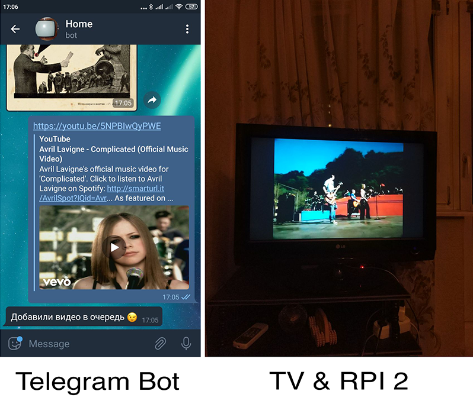

# HomeYoutubePi
Youtube player for Raspberry Pi via Telegram with omxplayer-wrapper & youtube-dl

## Requirements

* docker-compose
* docker

## Configure setup

Replace lines in .env file:
```
TELEGRAM_TOKEN - your Telegram BOT API token from @BotFather
TELEGRAM_PROXY - socks5 proxy string for Telegram. Remove this line if you don't need that
```

## Install

Clone this repo and launch docker-compose script on your Raspberry Pi:
```shell
git clone https://github.com/GeorgiyDemo/HomeYoutubePi
cd HomeYoutubePi
docker-compose up -d
```

## Docker containers description
- Redis - database for FIFO queue
- Dashboard - RQ dashboard on host:9181
- Player - player for youtube's video processing from url in Redis
- Telegram - client for adding urls to Redis

## Beautiful example
<p align="center">

</p>